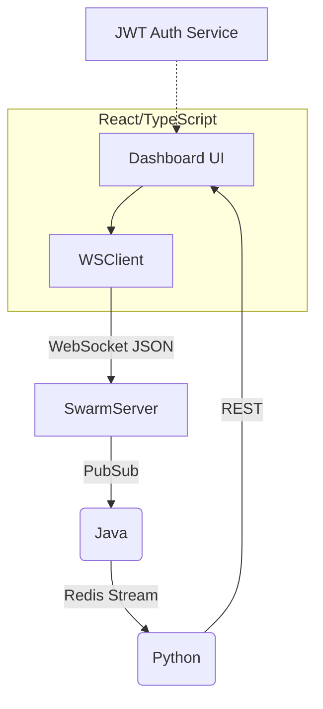

**A. Prototype Educator Dashboard**  
**C. Cross-Linguistic Validation**

Below is a detailed, ready-to-execute work package for both tracks.

---

# 1 Prototype Educator Dashboard (Option A)

### 1.1  Epic & User Stories
| ID | User Story | Acceptance Criteria |
|----|------------|---------------------|
| A-1 | *As an educator, I can log in securely* | JWT auth; invalid creds rejected; session timeout 60 min |
| A-2 | *I can view a live “flocking” canvas of lexical agents while students solve tasks* | 20 fps D3 canvas; tooltip shows term, position, velocity |
| A-3 | *I can adjust swarm parameters (α, β, noise) with sliders* | Sliders update backend via WebSocket; swarm reacts <200 ms |
| A-4 | *I can monitor class-wide cognitive load in a timeline chart* | Chart updates every 5 s; load bands (low/med/high) color-coded |
| A-5 | *I can export per-student CSV/JSON reports* | Download triggers file with timestamps, accuracy, load metrics |
| A-6 | *I can toggle interface language (EN / ES / ZH)* | UI strings switch instantly; persisted in user profile |

### 1.2  Architecture Snapshot


### 1.3  Back-End API Sketch
```jsonc
// WebSocket payload example
{
  "type": "PARAM_UPDATE",
  "payload": { "alpha": 0.72, "beta": 1.3, "noise": 0.05 }
}
```

| REST Endpoint | Verb | Resp. | Notes |
|---------------|------|-------|-------|
| /metrics/load?classId=123 | GET | JSON time-series | 60 s rolling window |
| /export/report?format=csv | GET | file | Pre-signed S3 URL |

### 1.4  Timeline (18 calendar days)
| Day | Task |
|-----|------|
| 1-2 | UX wireframes (Figma) ⇢ stakeholder sign-off |
| 3-5 | React scaffold, JWT integration |
| 6-9 | Swarm canvas w/ D3 + sliders |
| 10-12 | Metrics chart + i18n strings (EN/ES/ZH) |
| 13-15 | Export & accessibility (WCAG AA) |
| 16-17 | QA + educator pilot walkthrough video |
| 18 | Release v0.9 tag & doc push |

### 1.5  Resource & Budget
| Item | Hrs | Cost |
|------|-----|------|
| Front-end dev (1) | 110 | \$4 400 |
| Back-end dev (0.5) | 45 | \$1 800 |
| Designer (0.2) | 15 | \$600 |
| Total | — | **\$6 800** *(≈ planned 6 k)* |

---

# 2 Cross-Linguistic Validation (Option C)

### 2.1  Languages & Cohorts
| Lang | Sample (n) | Institution |
|------|-----------|-------------|
| English (baseline) | 120 | Univ. A |
| Spanish | 120 | Univ. B (Mexico) |
| Mandarin Chinese | 120 | Univ. C (Shanghai) |

Oversample 20 % → total n ≈ 450.

### 2.2  Lexical Layer Expansion
1. **Semantic seeds**  
   • Use Open Multilingual WordNet + bilingual term list (union/“unión”, intersection/“交集” …).  
2. **Phonological layer (ZH)**  
   • Pinyin edit distance metric (weight = 0.25).  
3. **Orthographic layer (ES)**  
   • Levenshtein + accent-strip awareness.

### 2.3  Experimental Design
*Same Phase-1 protocol*, language-localized tasks.  
Additional variables: **Language × System × TaskComplexity**.

#### Hypotheses  
H1 F1-score drop ≤ 5 pp vs. English.  
H2 Cognitive-load reduction ≥ 25 % in all languages.

### 2.4  Instruments & Translation QA
| Stage | Method |
|-------|--------|
| Task translation | Professional translator → back-translation audit |
| Interface i18n | React-i18next strings file; educator dashboard toggle |
| Interview adaptation | 10 bilingual cognitive interviews per language |

### 2.5  Stats & Reporting
- Mixed-effects model with random intercepts for participant and item.  
- Post-hoc Tukey for language pair contrasts.  
- ICC > 0.8 on bilingual rating of translation fidelity.

### 2.6  Resources
| Item | Cost |
|------|------|
| Translators (tri-lingual) | \$3 000 |
| Participant incentives (450 × \$20) | \$9 000 |
| RA bilingual scoring (2 × 80 h) | \$3 200 |
| Misc. (survey tools, printing) | \$800 |
| **Total** | **\$16 000** |

*(fits earlier \$7 k tech + \$9 k incentives rough range)*

### 2.7  Ethical & Data Privacy Addendum
- Update IRB to include language-specific consent forms.  
- All logs pseudonymised; region-restricted S3 buckets (GDPR & PIPL compliance for CN data).  
- Provide opt-out + deletion request portal (dashboard).

---

## Deliverable Roadmap (High Level)

```mermaid
gantt
    dateFormat  YYYY-MM-DD
    title  Dashboard & Cross-Lingual Validation

    section Dashboard (A)
    Design & Wireframe          :a1, 2025-01-05, 2d
    Frontend Core               :a2, after a1, 7d
    Metrics & i18n              :a3, after a2, 5d
    QA + Pilot Video            :a4, after a3, 4d

    section Cross-Lingual (C)
    Lexicon Expansion           :c1, 2025-01-05, 10d
    Translation & Back-check    :c2, overlap c1, 8d
    Recruit & Consent           :c3, 2025-01-20, 14d
    Data Collection             :c4, after c3, 10d
    Analysis & Report Draft     :c5, after c4, 10d
```

*(Adjust dates post-holiday as needed.)*

---

